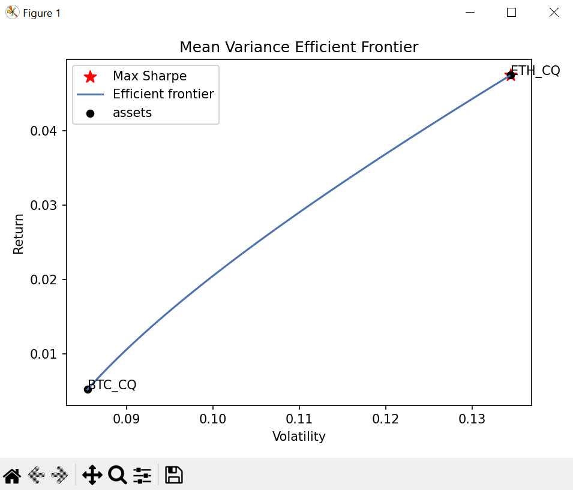

# Mean Variance Portfolio Optimization on Crypto Assets
Using crypto perpetual futures contracts via Huobi API

## Prerequisites
For this development, I am using `Python 3.9.16` and `conda` environment

## Software Libraries
- asyncio=3.4.3
- aiohttp=3.8.1
- pandas=1.5.3
- numpy=1.24.1
- matplotlib=3.6.3
- pyportfoliopt=1.5.4

## Installation
Install dependencies in `requirements.txt` before running `main.py`
```bash
conda install --file requirements.txt
```

## Running Script
From the project root folder, execute this command to start running the script.
```bash
python3 main.py
```

## Outcome
I am able to retrieve only BTC and ETH historical prices as other futures contracts have been suspended by Huobi. Furthermore, I am using `asyncio` and `aiohttp` modules to effectively request API calls for crypto prices.


